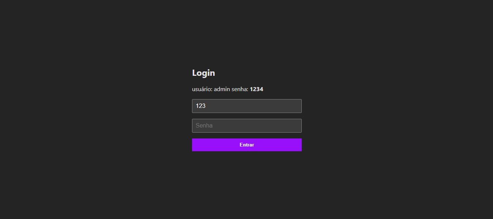
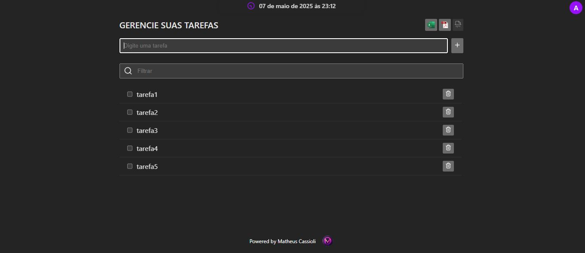

# 👥 **Vue Task Manager**

Este é um projeto desenvolvido com **Vue.js** que permite gerenciar tarefas. Ele inclui funcionalidades como **cadastro**, **listagem**, **exclusão**, além de **exportação para PDF e Excel**, tudo salvo localmente no **localStorage**. O projeto está em constante evolução e a próxima etapa será a implementação de uma **autenticação simples**.

---

## 💡 **Motivação**

Como desenvolvedor com experiência em **React**, estou explorando o ecossistema do **Vue.js** para ampliar meu repertório. Este projeto representa o início dessa jornada, oferecendo uma aplicação prática para aprender sobre os fundamentos e as boas práticas de Vue.js.

---

## 🚀 **Tecnologias Utilizadas**

- 🖖 [Vue 3](https://vuejs.org/) — Framework progressivo para criar interfaces de usuário.
- 🧠 **Composição com `ref`, `reactive`, e `computed`** — Para gerenciamento de estado e interatividade.
- 🧭 **LocalStorage** — Para persistência dos dados localmente no navegador.
- 🎨 **CSS puro**
- ⚙️ **Vite** como bundler para otimização e agilidade no desenvolvimento.

---

## ✨ **Funcionalidades Atuais**

- ✅ **Autenticação simples**: Login simples para acesso a rota privada.
- ✅ **Cadastro de tarefas**: Formulário simples para adicionar tarefas.
- ✅ **Listagem de tarefas**: Exibe as tarefas cadastradas em tempo real.
- ✅ **Exclusão de tarefas**: Permite remover tarefas da lista.
- ✅ **Exportação de dados**:
  - **PDF**: Permite exportar a lista de tarefas para um arquivo PDF.
  - **Excel**: Permite exportar a lista de tarefas para um arquivo Excel.
- ✅ **Persistência de dados**: Todas as tarefas são salvas no **localStorage**, garantindo que os dados não se percam ao recarregar a página.
- ✅ **Logout**: Logout limpando usuário localStorage.

🔜 **Próximos passos**:

- ⚙️ **Exploração de novas funcionalidades do Vue 3**, incluindo o uso de **Vue Router** e **Vuex** (ou **Pinia** para estado global).

---

## 💻 **Telas**




---

## 📦 **Como Rodar o Projeto Localmente**

### 1. Clone o Repositório

```bash
git clone https://github.com/matheuscassioli/vue-task-manager
cd vue-task-manager
```
